# condition-log

体調のすぐれない日でも開いてタップするだけで自分の体調を記録し、
変化を振り返り、診察時に医師へ経過を伝えるためのアプリです。

> 本アプリは本人の記録を整理・表示するためのものであり、診断や治療の判断を支援するものではありません。

## 主な機能

- 毎日の体調記録: 全体の体調と症状ごとの具合を段で選び、メモと、日々気を付けること
  （間食を控える・散歩を続けるなど）ができた日の印を添えます。過去の日にも書き足せます
- 診察の記録: 診察前に聞くことと診察で聞いたことを 1 回の診察ごとに残し、次の診察の
  予定も書いておけます。受診先（病院・診療科・医師）を登録して選び、受診先ごとに
  見返せます

予定している機能:

- 体調の推移の振り返り（気を付けることができた日の印を重ねて表示）
- アプリのロック、記録の書き出しと別の端末への読み込み

正本は [要求一覧](docs/requirements.md)「提供要求」です。

## 画面

架空の見本の記録を入れて、Android の実機で撮った画面です。左は OS の文字の大きさが既定の
とき、右は最大（2 倍）のときです。

| ページ | 既定の文字 | 最大の文字 |
|---|---|---|
| 体調（今日の記録） | 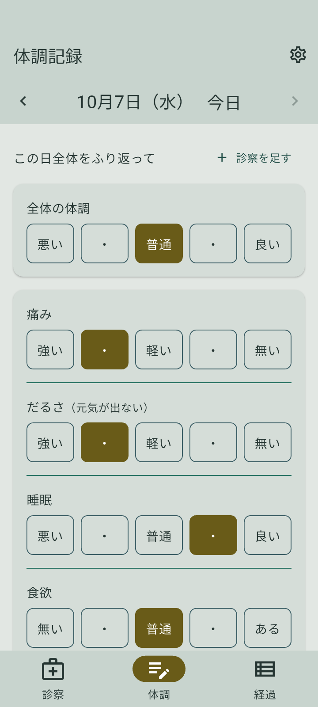 | 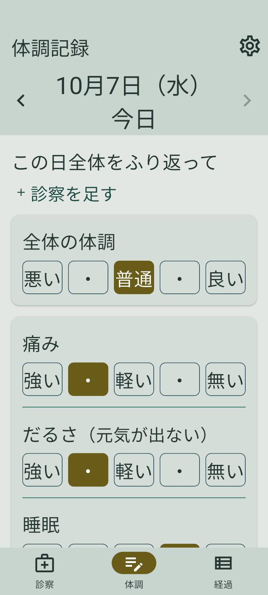 |
| 体調（同じページの終わり） | 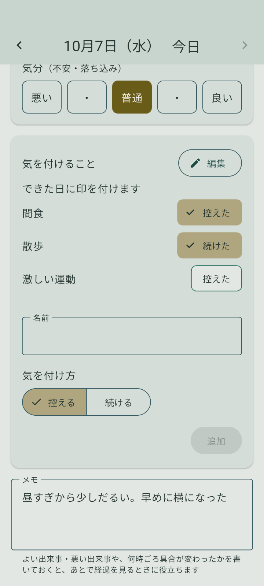 | 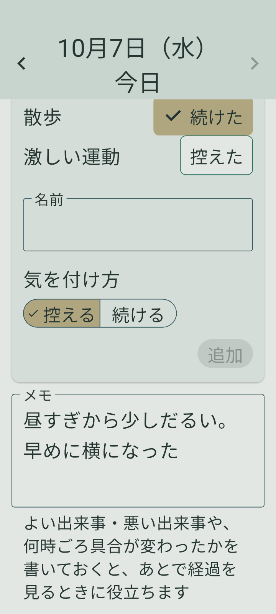 |
| 気を付けることの編集 | 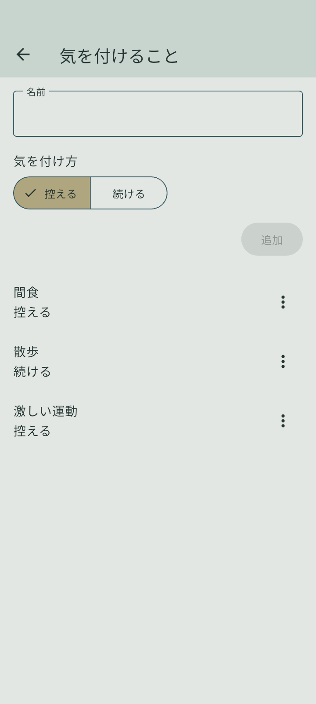 | 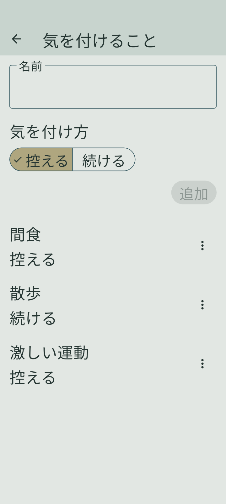 |
| 設定 | 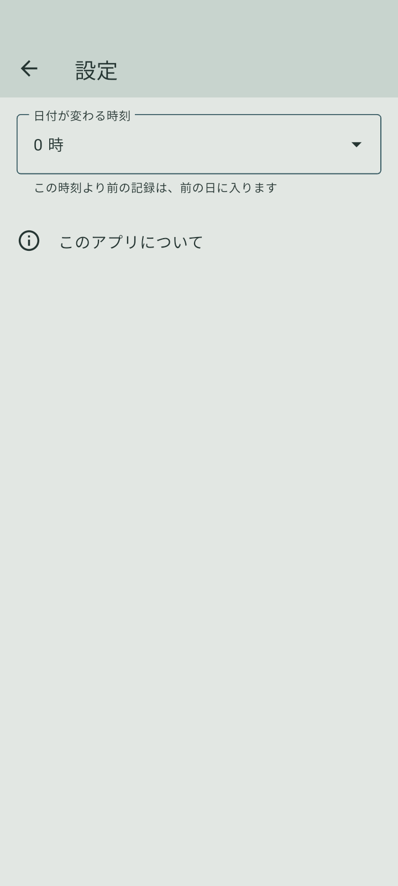 | 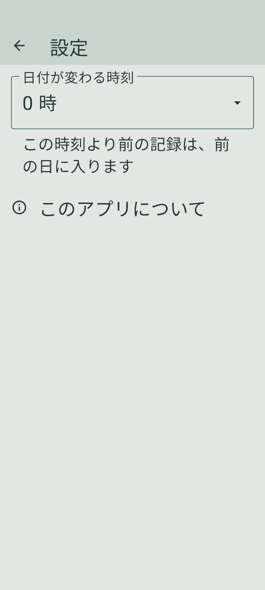 |
| 経過（準備中の表示） | 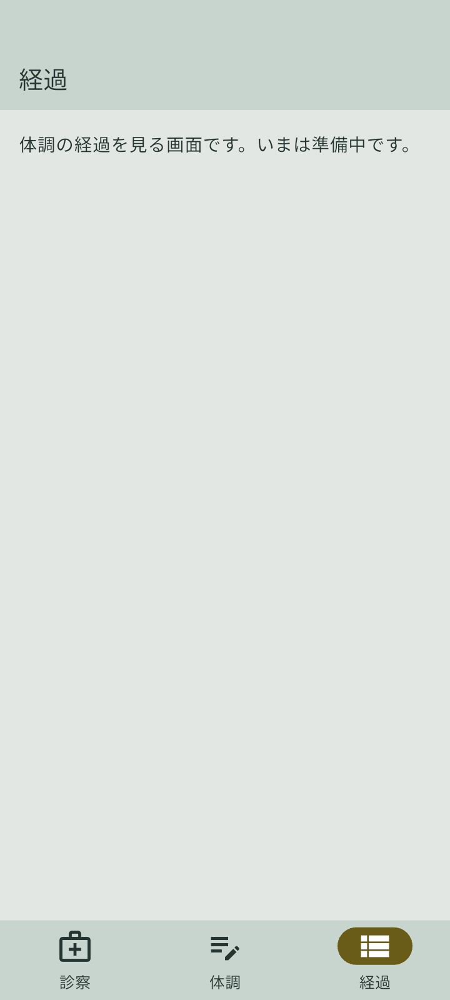 | 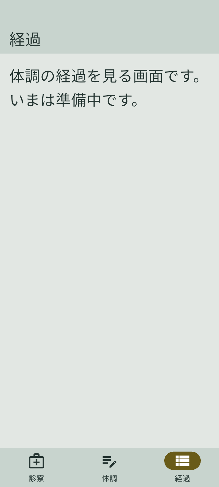 |
| 診察の一覧 | 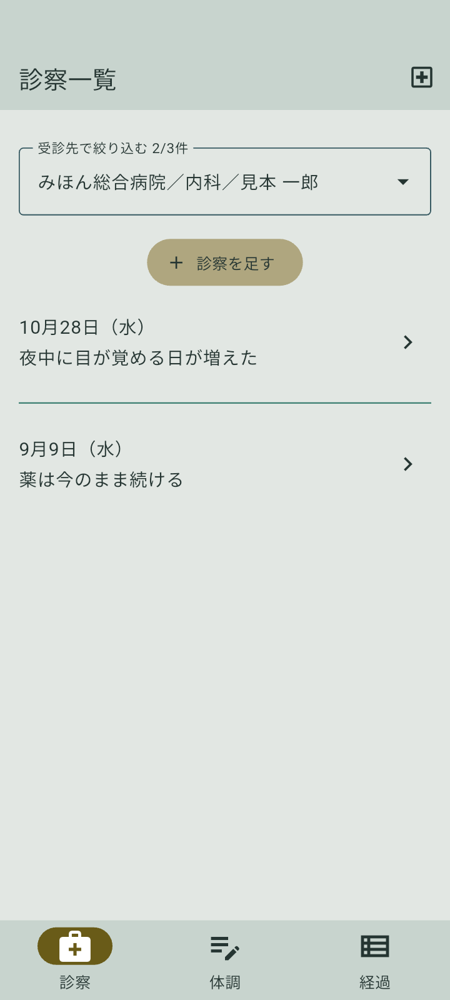 | 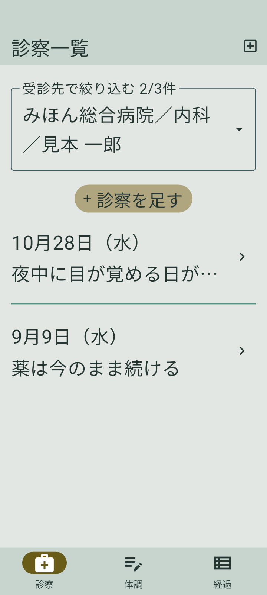 |
| 1 回の診察 | 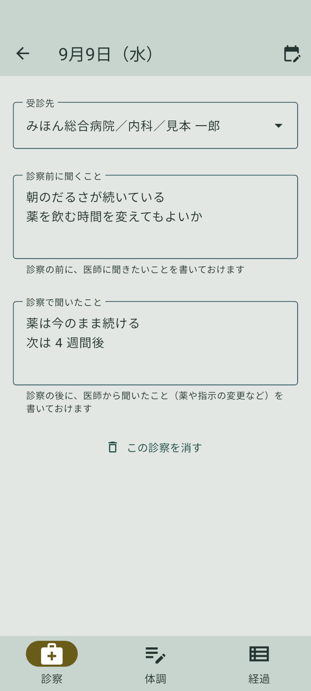 | 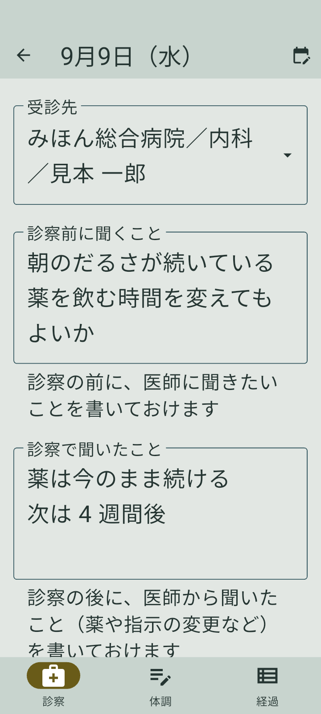 |
| 受診先 | 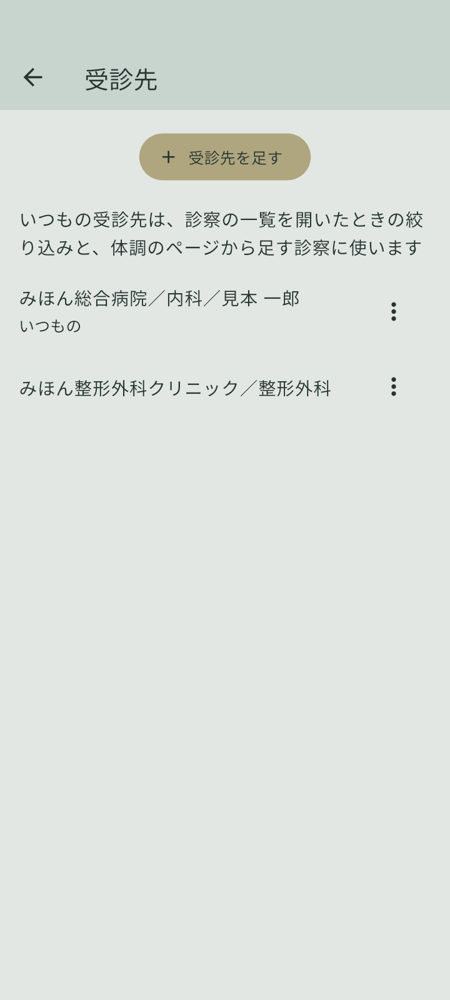 | 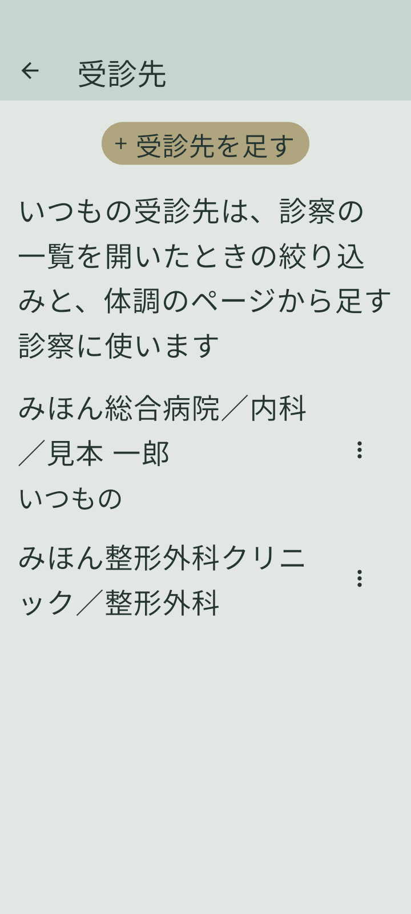 |

撮り直し方は [実機・エミュレータで確かめる](docs/references/device-check.md)「README の画面を撮り直す」にあります。

## 設計方針

- **医療上の判断をしない**: 診断・助言・独自の基準による判定をしません。医療機器に該当させず、表示を
  医学的な裏付けのある情報として読ませないためです
- **外部へ送信しない**: 記録はすべて端末内に置き、アプリから外部へ送信しません。要配慮個人情報を守り、
  オフラインでも使えるようにするためです

どちらも [要求一覧](docs/requirements.md)「プロジェクト憲章」が正本です。

## ドキュメント

- [要求一覧](docs/requirements.md): プロジェクト憲章・ビジネス要求・提供要求
- [作業書](docs/tasks/): 変更ごとの計画と記録
- [見え方記述](docs/appearance.md): 画面の色・文字・形の由来
- [記録](docs/records/): 時点の事実と出典
- [開発環境セットアップ（Windows 11）](docs/references/setup-windows.md): Android の開発環境を用意する手順
- [実機・エミュレータで確かめる](docs/references/device-check.md): adb でアプリを入れ、画面を撮り・読み・押し、文字の倍率を変える手順と、README の画面を撮り直す手順
- [DB の表と関係（ER 図）](docs/references/database-schema.md): 端末の DB の表・列・参照と、app_settings のキー
- [開発の規則](CONTRIBUTING.md): ブランチ・worktree・コミット・開発のコマンド・依存の版・パッケージの追加・`ios/` の扱い・文字コード

## 開発

コマンドは [開発の規則](CONTRIBUTING.md)「開発のコマンド」にあります。

### 技術スタック

Flutter / Dart、Riverpod、go_router、drift（SQLite）

- UI の文言は ARB に置き、言語を足せる形にしています（[TASK0008](docs/tasks/TASK0008_ui-localization.md)）

主要なものの抜粋です。依存の正本は `pubspec.yaml` です。

### 環境

- 対応 OS: Android / iOS（開発・検証は Android を先行）
- 作者の環境
  - 開発: Windows 11 / PowerShell（[セットアップの手順](docs/references/setup-windows.md)）
  - 検証: Android エミュレータ（API 37）・Android 実機
  - iOS のビルド: 別の Mac で行う
